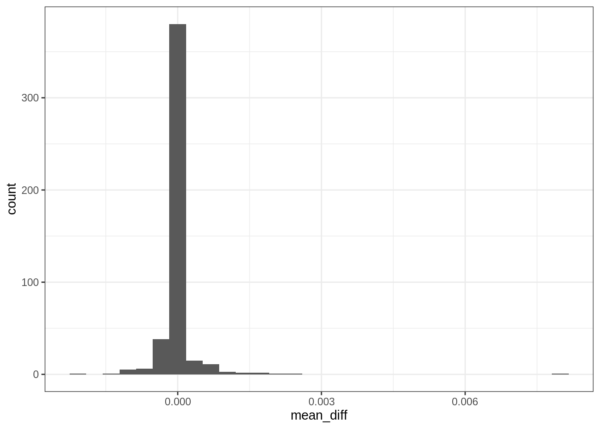
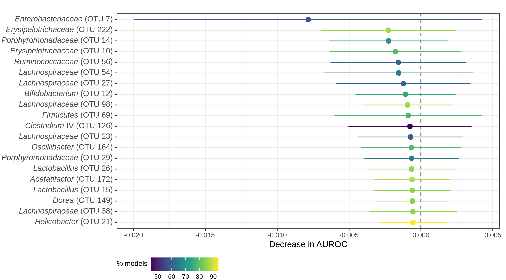

ML Results
================
2022-02-05

    ## here() starts at /Users/kelly/projects/schloss-lab/Barron_IBD-CDI_2022

    ## ── Attaching packages ───────────────────────────────────────────────── tidyverse 1.3.1 ──

    ## ✔ ggplot2 3.3.5     ✔ purrr   0.3.4
    ## ✔ tibble  3.1.6     ✔ dplyr   1.0.7
    ## ✔ tidyr   1.1.4     ✔ stringr 1.4.0
    ## ✔ readr   2.1.1     ✔ forcats 0.5.1

    ## ── Conflicts ──────────────────────────────────────────────────── tidyverse_conflicts() ──
    ## ✖ dplyr::filter() masks stats::filter()
    ## ✖ dplyr::lag()    masks stats::lag()

Machine learning algorithms used include: rf. Models were trained with
100 different random partitions of the data into training and testing
sets using 5-fold cross validation.

## Model Performance

## Hyperparameter Performance

## Memory Usage & Runtime

Each model training run was given 12 cores for parallelization.

## Feature Importance

    ## Rows: 42120 Columns: 9
    ## ── Column specification ──────────────────────────────────────────────────────────────────
    ## Delimiter: ","
    ## chr (4): names, method, perf_metric_name, groups
    ## dbl (5): perf_metric, perf_metric_diff, pvalue, seed, train_frac
    ## 
    ## ℹ Use `spec()` to retrieve the full column specification for this data.
    ## ℹ Specify the column types or set `show_col_types = FALSE` to quiet this message.

<!-- --><!-- --><!-- -->

<!-- -->
